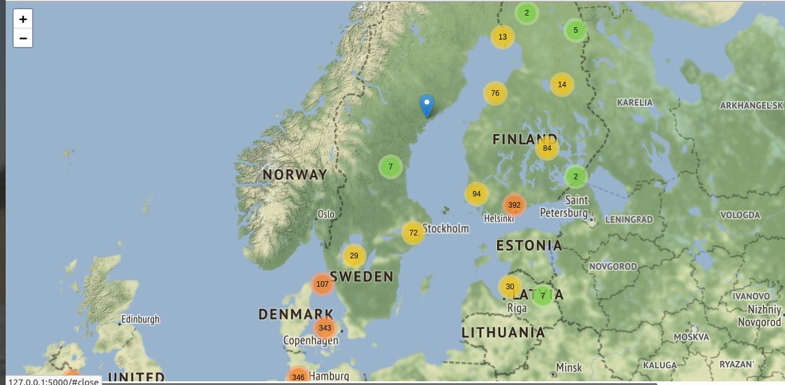
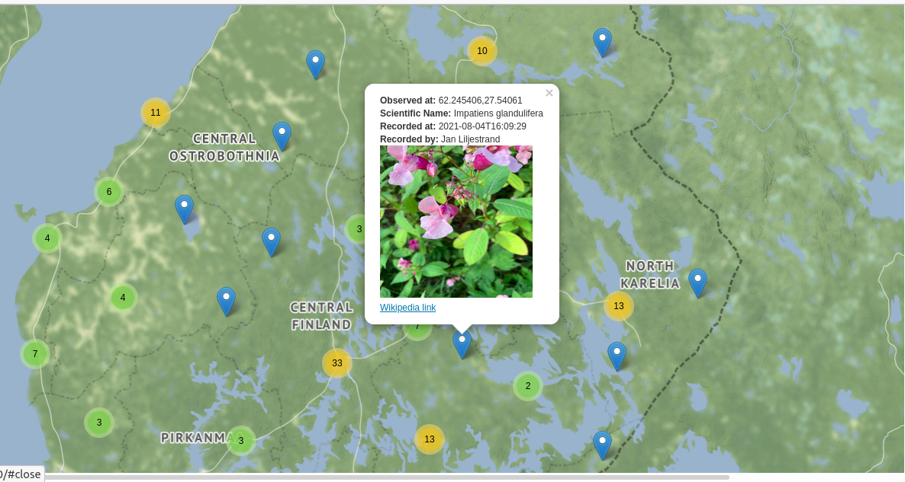

# Invasive Species in EU Mapper
A web app using the power of citizen data. This app lets an user find out information out Invasive species of EU concern that has been reported anywhere in the EU from various sources. 

 
Table of Contents
=================

 * [Why?](#why)
 * [Main data sources](#Main-data-sources)
 * [Installation](#Installation-and-running)
 * [Usage](#Usage)
 * [Git Integration](#Git-integration)
 * [Website](Website)
 * [Architecture Diagram](Architecture-Diagram)
 * [Logs](logs)

### Why?

I wanted to create a website that:

+ Harnesses the power of citizen data
+ A Layperson could search for invasive species in a given location on a map
+ The website should also work as a look up tool to cross reference a sighting a person had with a previously reported sighting
+ Give some information about sightings- pictures, wikipedia links to more info etc.

### Main data sources

+ EASIN European Alien Species Information Network [API](https://easin.jrc.ec.europa.eu/api/cat/euconcern).
 I am using only species that are marked as of EU CONCERN. As of now 48 species in all.
+ GBIF—the Global Biodiversity Information Facility—is an international network and data infrastructure funded by the world's governments and aimed at providing anyone, anywhere, open access to data about all types of life on Earth. This gives us access to data uploaded by users of many websites and mobile applications from across users that have uploaded their sightings on these platforms. 


### Installation and running
---


In this method you use the data from this repository. It is updated every month.
On the command line, type:

```
git clone https://github.com/widadmogral/Invasive-species-in-EU-Mapper
cd Invasive-species-in-EU-Mapper/
 make install
 ```

This will also take care of installing additional dependencies. If you dont want the dependencies to persist, consider running this in a virtual environment.

This will run the flask web application that will run at http://127.0.0.1:5000 You can open this in your web browser.

Works well in Firefox and Chrome, Popups don't show up well on Safari 


### Usage
---
Each observation of a confirmed Invasive species report is shown as markers on the map. If many markers are in an area, they are clustered together. 



Zoom into see individual markers. Clicking a marker will open a popup that will show details of a report with pictures. A wikipedia link is provided to give further information.



### Git integration
-----
The data download from gbif.org is automated through github actions on the first of every month. Run

`git pull` 

if you would like to refresh downloaded data

### Website
-----
A hosted version can be found in www.widad.pythonanywhere.com

### Architecture Diagram
-----
![img][arch_diagram.jpg]

### Logging
-----
To make debugging easier, error logs for database load can be found in database.log file and app.log for errors while loading the app.


